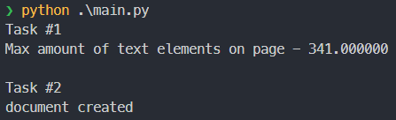
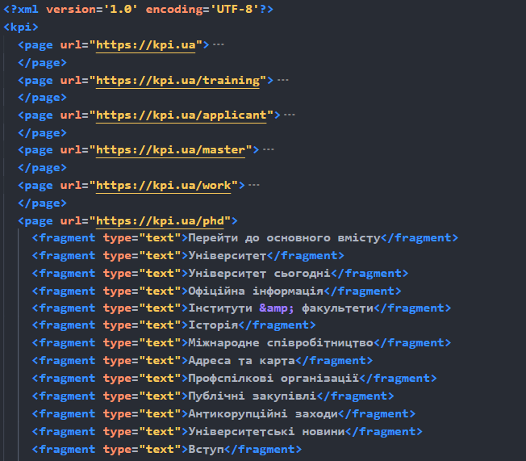
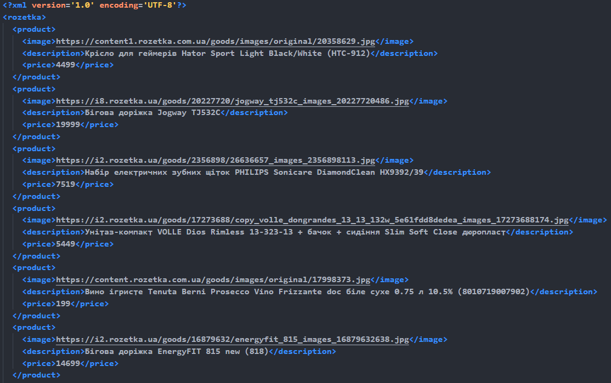
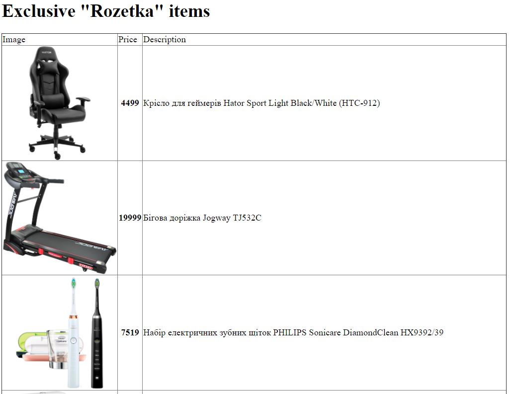

# Лабораторна робота №1

## Variant 1 (21 % 20 = 1)

| Базова сторінка (завдання 1) | Зміст завдання 2     | Адреса інтернет-магазину (завдання 3) |
|------------------------------|----------------------|---------------------------------------|
| www.kpi.ua         | Максимальна кількість текстових фрагментів | www.rozetka.ua |

## Code

### Scrapper class for first task

```python
from scrapy.http.response import Response
import scrapy


class KpiSpider(scrapy.Spider):
    name = 'kpi'
    allowed_domains = ['kpi.ua']
    start_urls = ['https://kpi.ua']

    def parse(self, response: Response):
        image_elements = response.xpath("//img/@src")
        text_elements = response.xpath("//*[not(self::script)][not(self::style)][not(self::title)][string-length(normalize-space(text())) > 0]/text()")
        yield {
            'url': response.url,
            'text_elements': map(lambda text: text.get().strip(), text_elements),
            'image_elements': map(lambda image: 'https://kpi.ua' + image.get() if image.get().startswith('/') else image.get(), image_elements)
        }

        if response.url == self.start_urls[0]:
            link_elems = response.xpath(
                "//a/@href[starts-with(., 'https://kpi.ua/') or starts-with(., '/')]"
            )
            links = [
                link.get() for link in link_elems if link.get() != "/"
            ]
            for link in links[:20]:
                if link.startswith("/"):
                    link = "https://kpi.ua" + link
                yield scrapy.Request(link, self.parse)

```

### Scrapper class for second task

```python
import json
import scrapy
from scrapy.http.response import Response
from scrapy.selector import Selector

class RozetkaSpider(scrapy.Spider):
    name = 'rozetka'
    allowed_domains = ['rozetka.com.ua']
    start_urls = ['https://xl-main-api.rozetka.com.ua/v3/sections/get?front-type=xl&sectionExclusive=&sectionNowInDemand1=rank=1&sectionHotNewProducts=&sectionNowInDemand2=rank=2&lang=ua']

    def parse(self, response: Response):
        data = json.loads(response.text)

        for product in data['data']["sectionExclusive"]["goods"][:20]:
            yield {
                'image': product["images"][0]["original"],
                'description': product["title"],
                'price': str(product["price"]["current"])
            }
```

## Results







